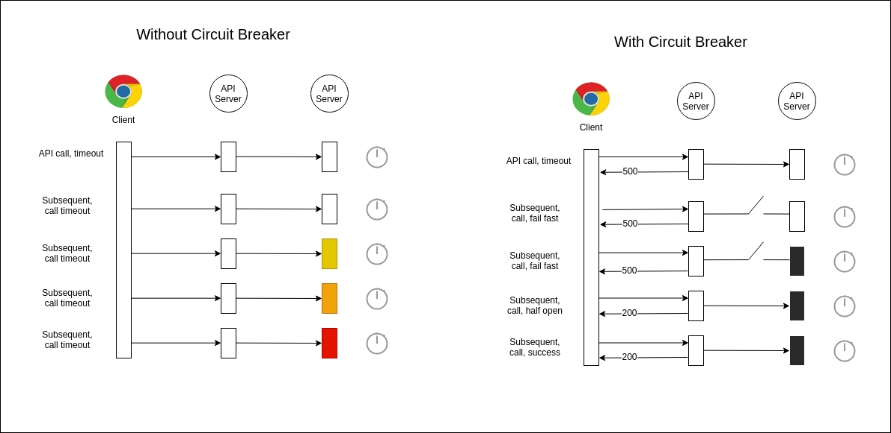

# Sample API with Circuit Breaker in TypeScript

## Context and problem

- Distributed environment
    - Slow network connection
    - Timeout or overloaded resources
    - Temporarily unavailable features
    - Unforeseen events
    - Complete failure of a service
    - Cascading failure

## Solution

The Circuit Breaker pattern, popularized by Michael Nygard in his book, Release It! , can prevent an application from repeatedly trying to perform an operation that is likely to fail.

- Allow it to continue without waiting for the bug to be fixed
- Allow an application to detect if the crash is resolved

## States

## Example

## When to use?
- Use the pattern
    - To prevent an application from trying to invoke a remote service or access a shared resource if that operation is likely to fail.
- This pattern is not recommended
    - To handle access to local private resources in an application, such as in-memory data structure. In this environment, using a circuit breaker would add overload to your system.
    - As a replacement for exception handling in your applications' business logic.

## Libraries

[Brakes](https://www.npmjs.com/package/brakes)

[Opossum](https://nodeshift.dev/opossum/)

[resilience4j](https://resilience4j.readme.io/docs)

# **References**

[CircuitBreaker](https://martinfowler.com/bliki/CircuitBreaker.html)

[Circuit Breaker pattern](https://docs.microsoft.com/en-us/azure/architecture/patterns/circuit-breaker)

[Pattern: Circuit Breaker](https://microservices.io/patterns/reliability/circuit-breaker.html)